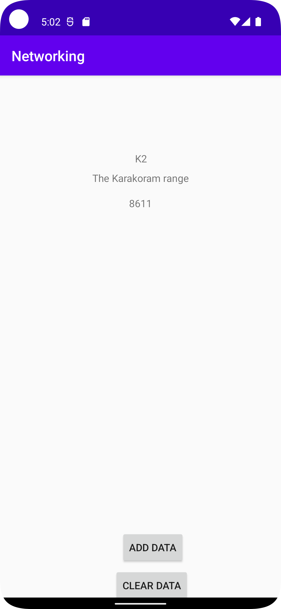

# Rapport


Jag började med att skapa en adapter till min recycler view, en adapter gör att man sätter ihop de olika
delar ihop det vill säga viewholdern och sedan själva getters o setter dessa kan man se i figur 1.

Det getter och setter gör är att de hämtar information från json data och setter sätter värdet i detta fall så 
är det en text. 

Efter det skapade jag en viewholder det en viewholder gör är att den hämtar alla element 
för att man sedan ska kunna visa upp dem. exempel på detta är i figur 2.

jag skapade knappar för att visa data och ta bort data för att ge det en mer "verklighets"
känsla med detta menar jag att man själva väljer när data ska visas.

Som man kan se i figur 3 så är det för att hämta data, det den gör är att varje gång
man klickar add data så kommer det data upp. 

## Följande grundsyn gäller dugga-svar:

- Ett kortfattat svar är att föredra. Svar som är längre än en sida text (skärmdumpar och programkod exkluderat) är onödigt långt.
- Svaret skall ha minst en snutt programkod.
- Svaret skall inkludera en kort övergripande förklarande text som redogör för vad respektive snutt programkod gör eller som svarar på annan teorifråga.
- Svaret skall ha minst en skärmdump. Skärmdumpar skall illustrera exekvering av relevant programkod. Eventuell text i skärmdumpar måste vara läsbar.
- I de fall detta efterfrågas, dela upp delar av ditt svar i för- och nackdelar. Dina för- respektive nackdelar skall vara i form av punktlistor med kortare stycken (3-4 meningar).

Programkod ska se ut som exemplet nedan. Koden måste vara korrekt indenterad då den blir lättare att läsa vilket gör det lättare att hitta syntaktiska fel.

```
  public String getName() {
        return name;
    }
```
Figur 1
```
        name = itemView.findViewById(R.id.mountain_name);
```
Figur 2
```

        getData.setOnClickListener(new View.OnClickListener() {
            @Override
            public void onClick(View view) {
                new JsonTask(MainActivity.this).execute(JSON_URL);
            }
        });
```
Figur 3

Bilder läggs i samma mapp som markdown-filen.



Läs gärna:

- Boulos, M.N.K., Warren, J., Gong, J. & Yue, P. (2010) Web GIS in practice VIII: HTML5 and the canvas element for interactive online mapping. International journal of health geographics 9, 14. Shin, Y. &
- Wunsche, B.C. (2013) A smartphone-based golf simulation exercise game for supporting arthritis patients. 2013 28th International Conference of Image and Vision Computing New Zealand (IVCNZ), IEEE, pp. 459–464.
- Wohlin, C., Runeson, P., Höst, M., Ohlsson, M.C., Regnell, B., Wesslén, A. (2012) Experimentation in Software Engineering, Berlin, Heidelberg: Springer Berlin Heidelberg.
